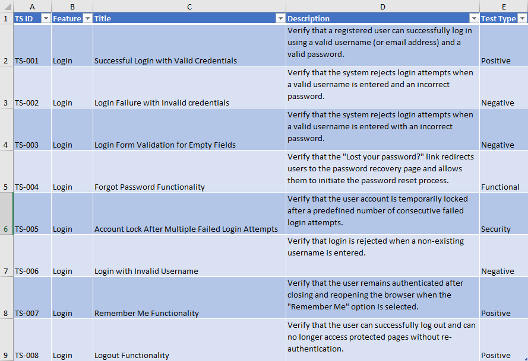
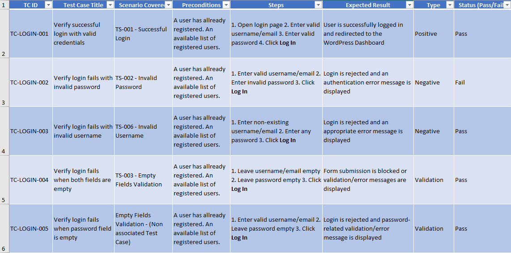

<h1>WordPress Login Form Testing Project</h1>

<h2>Project Overview</h2>

  A mini QA project focused on testing a WordPress login form. The project demonstrates manual testing, defect reporting, and test design techniques.

<h2>Objectives</h2>
<ul>
  <li>Practice QA testing fundamentals.</li>
  <li>Improve test design and bug reporting skills.</li>
  <li>Build a portfolio-ready testing project.</li>
</ul>

<h2>How to read my project? Start by following the list bellow.</h2>
<ol>
  <li>test scenarios,</li>
  <li>test cases</li>
  <li>bug reports</li>
  <li>Test design techniques: Decision Table testing, State Transition Diagram.</li>
</ol>

<h2>Application Under Test (AUT)</h2>

  <strong>URL:</strong>
  <a href="https://wordpresstest.ggeorgiou.work/wp-login.php">
    https://wordpresstest.ggeorgiou.work/wp-login.php
  </a>

  <strong>Application Type:</strong> WordPress Login Form

<h2>Test Scenarios</h2>

  Created 9 test scenarios covering login, validation, password recovery, account lock, remember me, and logout functionality.

  

<h2>Test Cases</h2>

  Created 10 detailed test cases including positive, negative, validation, security, and session testing.

  

<h2>Bug Reports</h2>

  Created sample bug reports demonstrating defect documentation, severity assessment, priority assignment, and reproducible steps.

<h2>Decision Table Testing</h2>

  Applied an optimized <a href="Optimized Decision Table testing.txt">Decision Table Testing</a> to validate login authentication rules and eliminate redundant combinations.

<h2>State Transition Testing</h2>

  Created a <a href="state-transition-diagram.png">State Transition Diagram</a> showing login states, failed attempts, account lock behavior, logout flow, and password recovery flow.

<h2>Test Design Techniques Used</h2>
<ul>
  <li>Functional Testing</li>
  <li>Negative Testing</li>
  <li>Validation Testing</li>
  <li>Security Testing</li>
  <li>Decision Table Testing</li>
  <li>State Transition Testing</li>
</ul>

<h2>Tools Used</h2>
<ul>
  <li>WordPress</li>
  <li>Google Chrome</li>
  <li>GitHub</li>
  <li>Mermaid</li>
  <li>Microsoft Excel / Google Sheets</li>
</ul>

<h2>Lessons Learned</h2>
<ul>
  <li>Test Scenario Design</li>
  <li>Test Case Creation</li>
  <li>Bug Reporting</li>
  <li>Authentication &amp; Security Testing</li>
  <li>QA Documentation Best Practices</li>
</ul>

<h2>Author</h2>

  <strong>Georgios Georgiou</strong>

  Aspiring QA Tester with a background in Computer Science, WordPress development, and IT instruction, focusing on Manual Testing, Test Design, and Software Quality Assurance.

